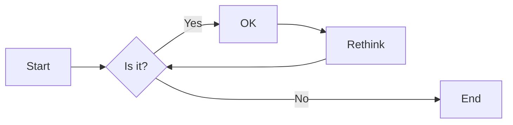
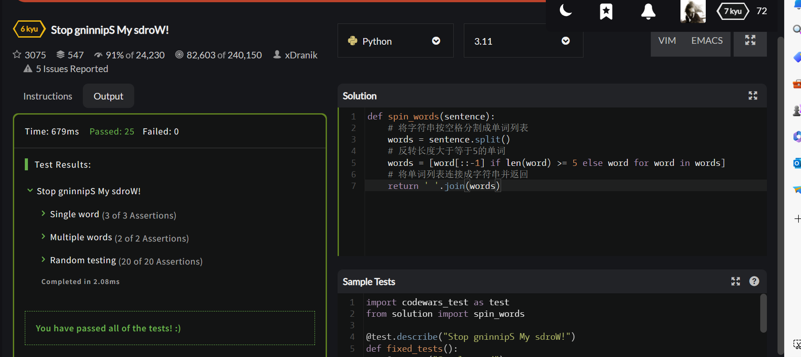
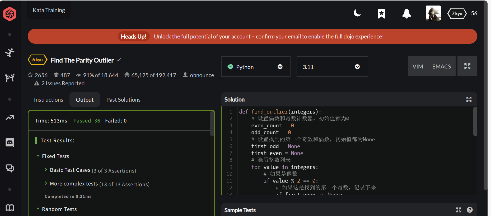
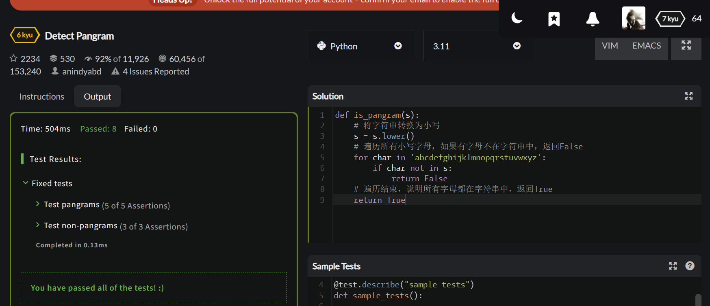
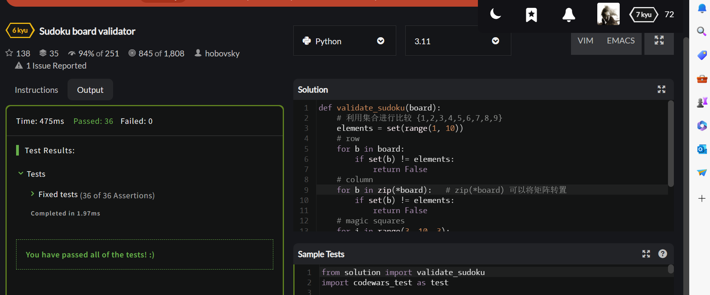
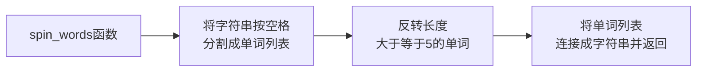
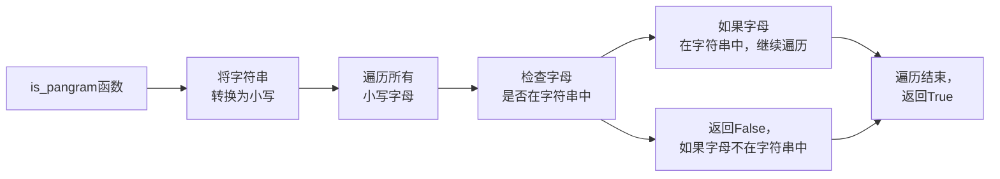

# 实验五 Python数据结构与数据模型

班级： 21计科2

学号： B20210302232

姓名： 闫新宇

Github地址：<https://github.com/yanxinyvvv/syfive.git>

CodeWars地址：<https://www.codewars.com/users/闫新宇>

---

## 实验目的

1. 学习Python数据结构的高级用法
2. 学习Python的数据模型

## 实验环境

1. Git
2. Python 3.10
3. VSCode
4. VSCode插件

## 实验内容和步骤

### 第一部分

在[Codewars网站](https://www.codewars.com)注册账号，完成下列Kata挑战：

---

#### 第一题：停止逆转我的单词

难度： 6kyu

编写一个函数，接收一个或多个单词的字符串，并返回相同的字符串，但所有5个或更多的字母单词都是相反的（就像这个Kata的名字一样）。传入的字符串将只由字母和空格组成。只有当出现一个以上的单词时，才会包括空格。
例如：

```python
spinWords( "Hey fellow warriors" ) => returns "Hey wollef sroirraw" 
spinWords( "This is a test") => returns "This is a test" 
spinWords( "This is another test" )=> returns "This is rehtona test"
```

代码提交地址：
<https://www.codewars.com/kata/5264d2b162488dc400000001>

提示：

- 利用str的split方法可以将字符串分为单词列表
例如：

```python
words = "hey fellow warrior".split()
# words should be ['hey', 'fellow', 'warrior']
```

- 利用列表推导将长度大于等于5的单词反转(利用切片word[::-1])
- 最后使用str的join方法连结列表中的单词。

---

#### 第二题： 发现离群的数(Find The Parity Outlier)

难度：6kyu

给你一个包含整数的数组（其长度至少为3，但可能非常大）。该数组要么完全由奇数组成，要么完全由偶数组成，除了一个整数N。请写一个方法，以该数组为参数，返回这个 "离群 "的N。

例如：

```python
[2, 4, 0, 100, 4, 11, 2602, 36]
# Should return: 11 (the only odd number)

[160, 3, 1719, 19, 11, 13, -21]
# Should return: 160 (the only even number)
```

代码提交地址：
<https://www.codewars.com/kata/5526fc09a1bbd946250002dc>

---

#### 第三题： 检测Pangram

难度：6kyu

pangram是一个至少包含每个字母一次的句子。例如，"The quick brown fox jumps over the lazy dog "这个句子就是一个pangram，因为它至少使用了一次字母A-Z（大小写不相关）。

给定一个字符串，检测它是否是一个pangram。如果是则返回`True`，如果不是则返回`False`。忽略数字和标点符号。
代码提交地址：
<https://www.codewars.com/kata/545cedaa9943f7fe7b000048>

---

#### 第四题： 数独解决方案验证

难度：6kyu

数独背景

数独是一种在 9x9 网格上进行的游戏。游戏的目标是用 1 到 9 的数字填充网格的所有单元格，以便每一列、每一行和九个 3x3 子网格（也称为块）中的都包含数字 1 到 9。更多信息请访问：<http://en.wikipedia.org/wiki/Sudoku>

编写一个函数接受一个代表数独板的二维数组，如果它是一个有效的解决方案则返回 true，否则返回 false。数独板的单元格也可能包含 0，这将代表空单元格。包含一个或多个零的棋盘被认为是无效的解决方案。棋盘总是 9 x 9 格，每个格只包含 0 到 9 之间的整数。

代码提交地址：
<https://www.codewars.com/kata/63d1bac72de941033dbf87ae>

---

#### 第五题： 疯狂的彩色三角形

难度： 2kyu

一个彩色的三角形是由一排颜色组成的，每一排都是红色、绿色或蓝色。连续的几行，每一行都比上一行少一种颜色，是通过考虑前一行中的两个相接触的颜色而产生的。如果这些颜色是相同的，那么新的一行就使用相同的颜色。如果它们不同，则在新的一行中使用缺失的颜色。这个过程一直持续到最后一行，只有一种颜色被生成。

例如：
```python
Colour here:            G G        B G        R G        B R
Becomes colour here:     G          R          B          G
```


一个更大的三角形例子：

```python
R R G B R G B B
 R B R G B R B
  G G B R G G
   G R G B G
    B B R R
     B G R
      R B
       G
```

你将得到三角形的第一行字符串，你的工作是返回最后的颜色，这将出现在最下面一行的字符串。在上面的例子中，你将得到 "RRGBRGBB"，你应该返回 "G"。
限制条件： 1 <= length(row) <= 10 ** 5
输入的字符串将只包含大写字母'B'、'G'或'R'。

例如：

```python
triangle('B') == 'B'
triangle('GB') == 'R'
triangle('RRR') == 'R'
triangle('RGBG') == 'B'
triangle('RBRGBRB') == 'G'
triangle('RBRGBRBGGRRRBGBBBGG') == 'G'
```

代码提交地址：
<https://www.codewars.com/kata/5a331ea7ee1aae8f24000175>

提示：请参考下面的链接，利用三进制的特点来进行计算。
<https://stackoverflow.com/questions/53585022/three-colors-triangles>

---

### 第二部分

使用Mermaid绘制程序流程图

安装VSCode插件：

- Markdown Preview Mermaid Support
- Mermaid Markdown Syntax Highlighting

使用Markdown语法绘制你的程序绘制程序流程图（至少一个），Markdown代码如下：


显示效果如下：



查看Mermaid流程图语法-->[点击这里](https://mermaid.js.org/syntax/flowchart.html)

使用Markdown编辑器（例如VScode）编写本次实验的实验报告，包括[实验过程与结果](#实验过程与结果)、[实验考查](#实验考查)和[实验总结](#实验总结)，并将其导出为 **PDF格式** 来提交。

## 实验过程与结果

### 第一部分 Codewars Kata挑战

**第1题：停止逆转我的单词**
```python
def spin_words(sentence):  
    # 将字符串按空格分割成单词列表  
    words = sentence.split()  
    # 反转长度大于等于5的单词  
    words = [word[::-1] if len(word) >= 5 else word for word in words]  
    # 将单词列表连接成字符串并返回  
    return ' '.join(words)
```
**运行结果**


**第2题：发现离群的数(Find The Parity Outlier)**
```python
def find_outlier(integers):
    # 设置偶数和奇数计数器，初始值都为0
    even_count = 0
    odd_count = 0
    # 设置找到的第一个奇数和偶数，初始值都为None
    first_odd = None
    first_even = None
    # 遍历整数列表
    for value in integers:
        # 如果是偶数
        if value % 2 == 0:
            # 如果这是找到的第一个奇数，记录下来
            if first_even is None:
                first_even = value
            # 如果当前奇数计数器的值大于1，说明离群的数是该偶数
            if odd_count > 1:
                return value
            # 偶数计数器加1            
            even_count += 1
            # 如果偶数计数器的值大于1，说明离群的数是该奇数
            # 如果第一个奇数不是None，返回第一个奇数
            if even_count > 1 and first_odd is not None:
                return first_odd 
        # 如果是奇数，奇数计数器加1       
        else:
            # 如果这是找到的第一个偶数，记录下来
            if first_odd is None:
                first_odd = value
            # 如果当前偶数计数器的值大于1，说明离群的数是该奇数
            if even_count > 1:
                return value
            # 奇数计数器加1
            odd_count += 1
            # 如果奇数计数器的值大于1，说明离群的数是该偶数
            # 如果第一个偶数不是None，返回第一个偶数
            if odd_count > 1 and first_even is not None:
                return first_even                  
    return None
```
**运行结果**


**第3题：检测Pangram**
```python
def is_pangram(s):
    # 将字符串转换为小写
    s = s.lower()
    # 遍历所有小写字母，如果有字母不在字符串中，返回False
    for char in 'abcdefghijklmnopqrstuvwxyz':
        if char not in s:
            return False
    # 遍历结束，说明所有字母都在字符串中，返回True
    return True
```
**运行结果**


**第4题：数独解决方案验证**
```python
def validate_sudoku(board):
    # 利用集合进行比较 {1,2,3,4,5,6,7,8,9}
    elements = set(range(1, 10))
    # row
    for b in board:
        if set(b) != elements: 
            return False
    # column
    for b in zip(*board):   # zip(*board) 可以将矩阵转置
        if set(b) != elements: 
            return False
    # magic squares
    for i in range(3, 10, 3):
        for j in range(3, 10, 3):
            if elements != {(board[q][w]) 
                            for w in range(j-3, j) 
                            for q in range(i-3, i)}:
                return False
    return True
```
**运行结果**


### 第二部分 使用Mermaid绘制程序流程图

**第1题：停止逆转我的单词**
```
flowchart LR  
A[spin_words函数] --> B[将字符串按空格\n分割成单词列表]  
B --> C[反转长度\n大于等于5的单词]  
C --> D[将单词列表\n连接成字符串并返回]
```



**第3题：检测Pangram**
```
flowchart LR  
A[is_pangram函数] --> B[将字符串\n转换为小写]  
B --> C[遍历所有\n小写字母]  
C --> D[检查字母\n是否在字符串中]  
D --> E[返回False，\n如果字母不在字符串中]  
D --> F[如果字母\n在字符串中，继续遍历]  
F --> G[遍历结束，\n返回True]  
E --> G
```



## 实验考查

1. 集合（set）类型有什么特点？它和列表（list）类型有什么区别？
<br/>(1)集合类型的特点是它具有①无序性：集合中的元素没有固定的顺序；②唯一性：集合中的元素是唯一的，不会有重复；③不稳定性：集合中的元素是可以随时被修改或删除的；④可变性：集合是可以被修改的，可以添加或删除元素；⑤自动排序：在某些编程语言中，如Python，集合会自动排序(2)它和列表类型区别在于①列表中的元素是有序的，即它们在列表中的位置是确定的；②列表可以包含重复的元素；③一旦一个元素被添加到列表中，除非你显式地删除它，否则它通常会一直保持在列表中④列表的元素可以不是唯一的；⑤列表不会自动排序。

2. 集合（set）类型主要有那些操作？
<br/>集合类型主要操作有①添加元素②移除元素③检查元素是否存在④获取集合的长度⑤集合交集⑥集合并集⑦集合差集

3. 使用`*`操作符作用到列表上会产生什么效果？为什么不能使用`*`操作符作用到嵌套的列表上？使用简单的代码示例说明。
<br/>(1)使用*操作符作用到列表上，会进行列表的重复操作。例如：
```python
list1 = [1, 2, 3]  
list2 = list1 * 3  # list2 现在是 [1, 2, 3, 1, 2, 3, 1, 2, 3]
```
在这个例子中，list1被复制了三次，所以list2包含了list1的三个重复版本。
<br/>(2)不能使用`*`操作符作用到嵌套的列表上，因为这样的行为是未定义的。`*`操作符在Python中用于重复对象，但是如果将其应用于嵌套列表，Python不会知道你是想复制整个嵌套列表还是复制其内部的子列表。

4. 总结列表,集合，字典的解析（comprehension）的使用方法。使用简单的代码示例说明。
①列表解析：列表解析是Python中创建列表的一种简洁方式。它使用一个表达式，后面跟随一个for语句，然后可能还有一个可选的if语句，用于筛选元素。
```python
# 创建一个列表，包含1到10的平方  
squares = [x**2 for x in range(1, 11)]  
print(squares)  # 输出：[1, 4, 9, 16, 25, 36, 49, 64, 81, 100]
```
②集合解析：集合解析与列表解析非常相似，但是它生成的是集合，而不是列表。集合是无序的，且不包含重复元素。
```python
# 创建一个集合，包含1到10的平方（去重）  
squares = {x**2 for x in range(1, 11)}  
print(squares)  # 输出：{1, 4, 9, 16, 25, 36, 49, 64, 81, 100}
```
③字典解析：字典解析可以用来创建字典。它使用一个键表达式和一个值表达式，然后跟随一个for语句，以及一个可选的if语句，用于筛选键值对。
```python
# 创建一个字典，键为1到10的平方，值为对应平方的字符串表示  
squares_dict = {x**2: str(x**2) for x in range(1, 11)}  
print(squares_dict)  # 输出：{1: '1', 4: '4', 9: '9', 16: '16', 25: '25', 36: '36', 49: '49', 64: '64', 81: '81', 100: '100'}
```

## 实验总结

通过本次实验学习到了集合类型及其操作，以及列表、集合和字典的解析。了解了集合类型是一种无序、唯一、不稳定的可变数据类型，它具有添加、删除、查询元素等操作。与列表类型相比，集合类型具有唯一性和无序性的特点，而列表类型是有序的，可以包含重复元素。并通过简单的代码示例，学习了列表解析、集合解析和字典解析。在实验中遇到的问题也通过询问老师、同学得到解决。